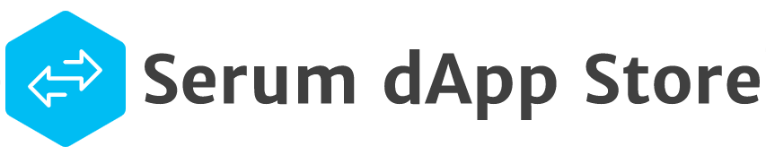

A tagged list of all the dApps for the serum ecosystem

[Check out the live site](https://gifted-newton-772e0f.netlify.app/)


#### How To Contribute?

If you want to add resources to the Dapp Store:

1. Open `courses/data.js` file in your preferred editor.

5. Append your dapp info in the `data` array by filling out the following JSON Template
    ```js
    {
        name:'Bonfida Serum DEX',
        url:'https://dex.bonfida.com/',
        description:'Bonfida DEX will give traders the best functionality and experience maintaining its place as the most used Serum DEX, including a builtin wallet, starter SOL airdrops, and more.',
        image: 'bonfida.png',
        tags:['web', 'token','bots','voting','advanced']
    }
    ```

1. **[Optional]**  You can also add your own custom  image, by adding the image in `courses\images\` folder and replacing `''` in `image:''` with the name of your image file (including extension).


### Making Styling Changes
This project uses SASS/SCSS syntax for styling.

1. Make all styling changes inside of `assets/main.scss` - do not edit `assets/main.css` directly.
2. To see/save your changes, install SASS for the command line: `npm i -g sass`
3. Run the SASS compile command from the project root: `sass assets/main.scss assets/main.css`
4. Confirm your changes on the client and in `assets/main.css`
5. Commit all of the following files: `assets/main.scss`, `assets/main.css` and `assets/main.css.map`
